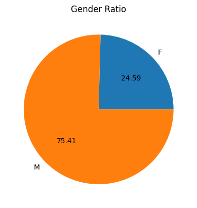
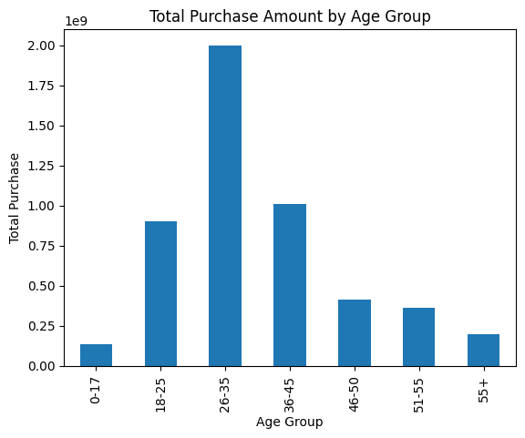
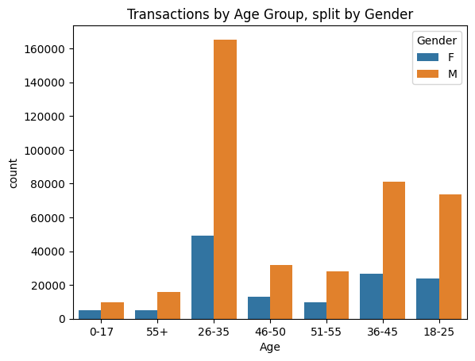
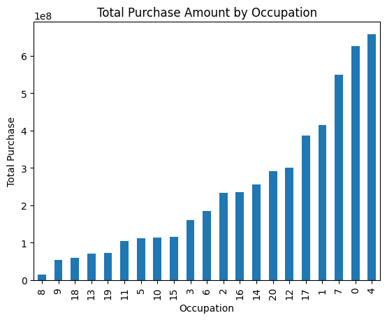
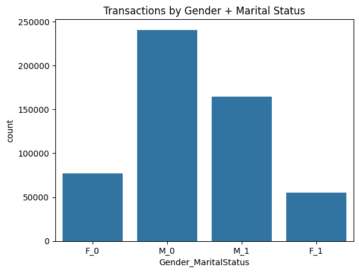

# 🛍️ Black Friday Sales Data Analysis

Exploratory Data Analysis of over 537,000 Black Friday transactions, examining how gender, age, marital status, occupation, and city category relate to customer purchasing behavior.

## 📌 Overview

Black Friday, the day after Thanksgiving, is known for deep discounts and some of the busiest shopping activity of the year. This project analyzes a large transaction-level dataset to understand who is spending, how much, and on what. The analysis is split into 5 notebooks, each building on the last:

1. **Dataset Walkthrough & Column Analysis** — load, inspect, and clean the data
2. **Gender Analysis** — purchasing trends by gender
3. **Age & Marital Status Analysis** — purchasing trends by age group and marital status
4. **Multi-Column Analysis** — combining Age, Gender, Marital Status, and City Category
5. **Occupation & Product Analysis** — how occupation relates to spending and product variety
6. **Combining Gender & Marital Status** — a combined view across every other variable

**Key questions explored:**
- Who shops more on Black Friday — men or women, married or unmarried customers?
- Which age groups and occupations spend the most?
- Does where a customer lives (city category) affect how much they spend?

## 📊 Dataset

The dataset is **"Black Friday Sales Data"** — a 23 MB CSV file containing 537,577 transaction records across 12 columns.

**Columns:**
| Column | Description |
|---|---|
| User_ID | Unique customer identifier |
| Product_ID | Unique product identifier |
| Gender | Customer gender (M/F) |
| Age | Customer age group (bucketed) |
| Occupation | Occupation code (masked/anonymized) |
| City_Category | City tier (A/B/C) |
| Stay_In_Current_City_Years | Years the customer has lived in their current city |
| Marital_Status | 0 = unmarried, 1 = married |
| Product_Category_1/2/3 | Product category codes |
| Purchase | Purchase amount |

📁 The raw dataset is included in this repo under [`data/BlackFriday.csv`](data/BlackFriday.csv).

## 🧹 Data Cleaning

- **Dropped `Product_Category_2` and `Product_Category_3`** — both columns were too sparse (heavily missing) to be useful for this analysis.
- Confirmed no further missing values after dropping those columns.
- No duplicate rows were found in the dataset.

## 🔍 Analysis

### 1. Dataset Walkthrough & Column Analysis
- Loaded the data and inspected structure, types, and missing values with `df.info()`.
- Explored the number of unique values in every column — **5,891 unique customers** and **3,623 unique products**.

### 2. Gender Analysis
- Counted transactions by gender and visualized the split with bar and pie charts.
- Calculated total and average purchase amount by gender using `groupby`.



### 3. Age & Marital Status Analysis
- Counted transactions and total spend by age group.
- Counted transactions and average spend by marital status.



### 4. Multi-Column Analysis
- Combined Age with Gender, Gender with Marital Status, and explored City Category on its own and against Gender.



### 5. Occupation & Product Analysis
- Analyzed transaction volume, total spend, and average spend by occupation.
- Looked at how many distinct products each occupation group purchased.
- Also explored `Stay_In_Current_City_Years` against Gender and City Category.



### 6. Combining Gender & Marital Status
- Created a combined `Gender_MaritalStatus` column (e.g. `M_0`, `F_1`) to analyze both factors together.
- Used Seaborn count plots to see how this combined segment behaves across Age, Product Category, Stay-in-City, and City Category.



## 💡 Key Insights

- **Male customers dominate the dataset**, accounting for about 75.4% of transactions (405,380 of 537,577) and about 76.8% of total purchase value (roughly $3.85B of the ~$5.02B total).
- **Men also spend slightly more per transaction on average** — ~$9,505 vs. ~$8,810 for women.
- **The 26–35 age group is by far the most active**, with 214,690 transactions — more than double the next closest group (36–45, with 107,499).
- **Unmarried customers (Marital_Status = 0) made more transactions** than married customers (317,817 vs. 219,760), though average spend per transaction is nearly identical between the two groups (~$9,333 vs. ~$9,335).
- **Unmarried males (`M_0`) are consistently the largest segment** across nearly every combination examined — by age, product category, city category, and years spent in the current city — making them the dominant customer group overall.
- **Purchasing behavior varies by occupation**, both in total spend and in the variety of distinct products purchased, suggesting occupation could be a useful signal for targeted offers.

## 🛠️ Tools & Technologies

- **Python 3**
- **Pandas** — data cleaning and manipulation
- **NumPy** — numerical operations
- **Matplotlib** — data visualization
- **Seaborn** — statistical visualization (count plots, distributions)
- **Jupyter Notebook** — analysis environment

## 🚀 How to Run

1. **Clone this repository**
   ```bash
   git clone https://github.com/AyushUmmadi/black-friday-sales-analysis.git
   cd black-friday-sales-analysis
   ```

2. **Install dependencies**
   ```bash
   pip install -r requirements.txt
   ```

3. **Launch Jupyter Notebook**
   ```bash
   jupyter notebook
   ```

4. Run the notebooks in order (01 → 05) to reproduce the full analysis.

## 📂 Project Structure

```
black-friday-sales-analysis/
├── README.md
├── 01_data_walkthrough_and_gender_analysis.ipynb
├── 02_analyzing_age_and_marital_status.ipynb
├── 03_multicolumn_analysis.ipynb
├── 04_occupation_and_product_analysis.ipynb
├── 05_combining_gender_marital_status.ipynb
├── data/
│   └── BlackFriday.csv
├── images/
│   └── (exported charts used in this README)
└── requirements.txt
```

## 🙏 Acknowledgments

This project was built while following an online data analysis certification course, using a provided dataset and guided project structure. All code, analysis, and this documentation were written and executed independently as part of my learning and portfolio development.
